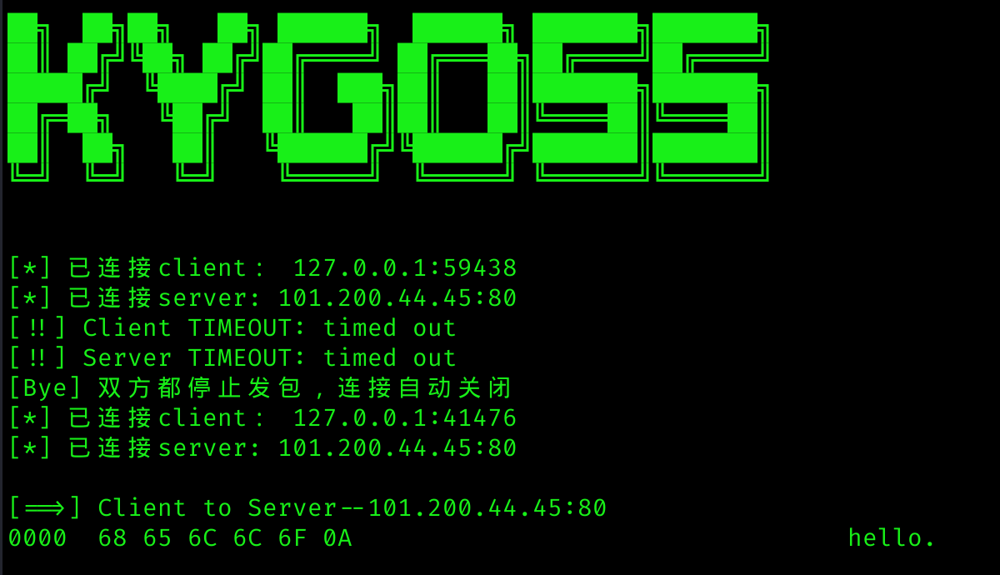
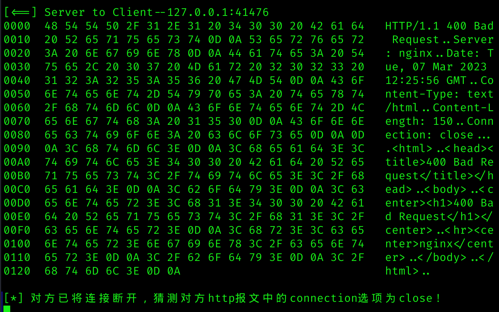

# 用法

使用以下命令启动TCP代理
```
python kgproxy.py [proxy_ip] [proxy_port] [server_ip] [server_port] [first_receive] [filename]

```

# 运行示例


  


# 技术回顾

## 一般逻辑

该程序执行的一般逻辑为：  
1. 持续监听从客户端来的请求  
2. 收到请求后，开启一个新线程  
3. 在新线程中连接远端服务器  
4. 连接完成后，TCP代理接收一方的数据并发给另一方，持续进行到双方都不进行为止   
  
## 重点函数

- sniff\_print(): 该函数要将接收到的字节转换为可被人类识别的信息，这就要求我们把信息中的英文字母、符号正确转换，同时将人类不可识别的（如/xev等）转换为点符号。  
- sniff\_change\_client() & sniff\_change\_server: 如果你需要更改将要转发的数据来进行模糊测试等工作，则可以在这两个函数中操作。  
- main\_loop(): 主循环函数，包括接收、转发、将数据写入文件等基础功能，以及智能关闭连接等其他功能。  

## 其他函数

- hostname\_to\_address(): 利用正则表达式匹配输入，如果输入为域名，则自动转换为ipv4地址。  
